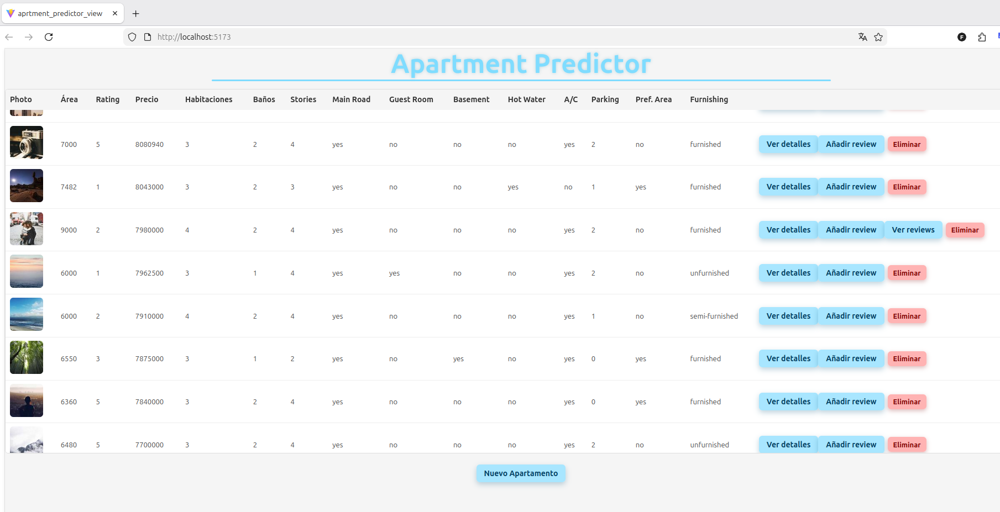
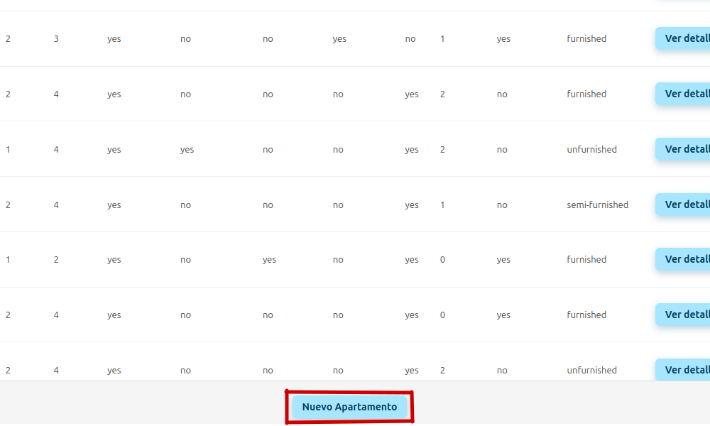
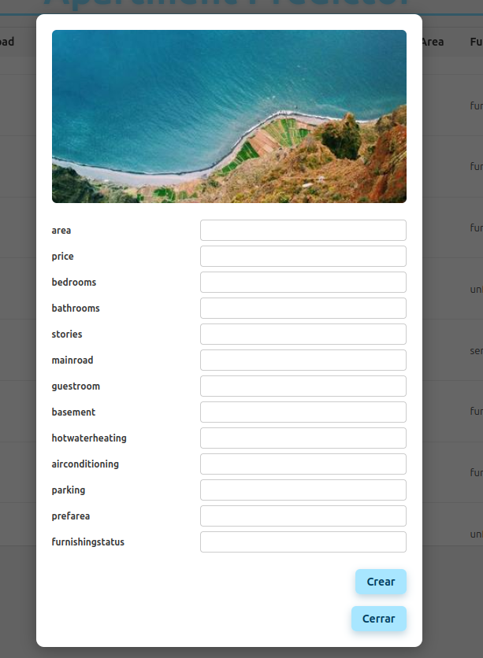
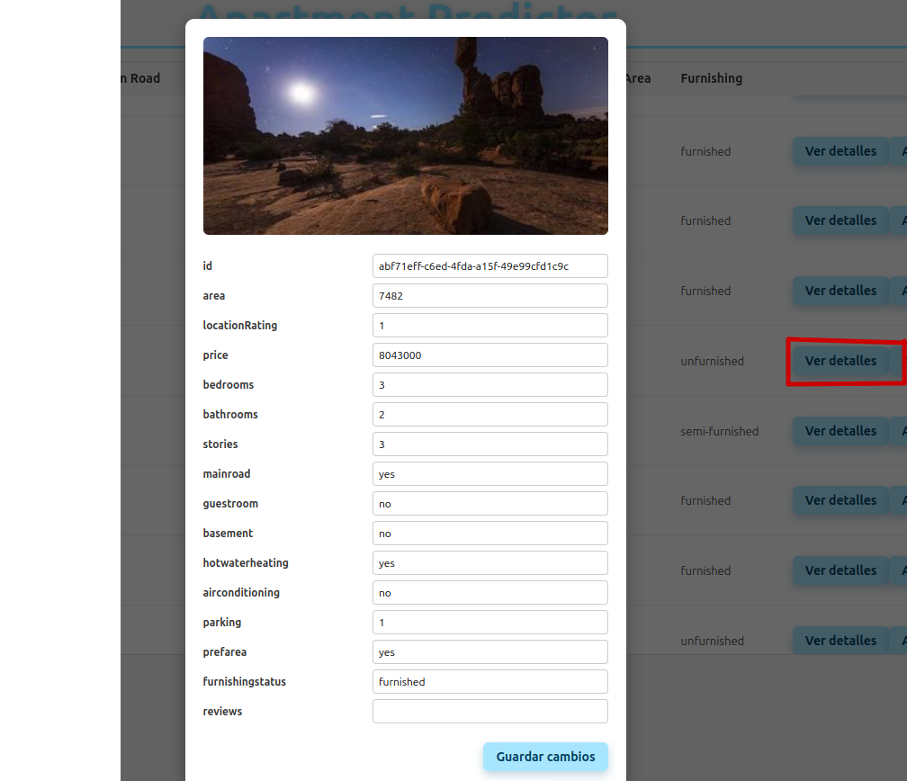
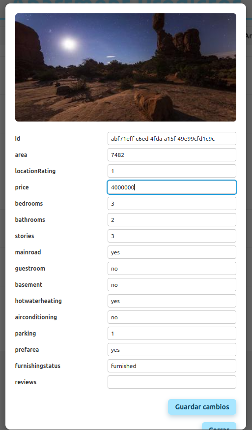
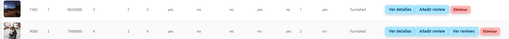
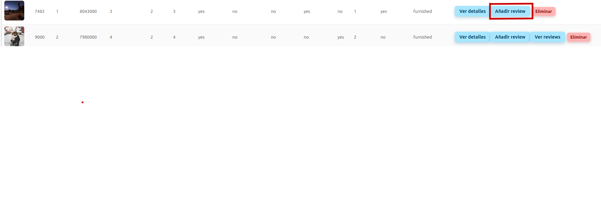
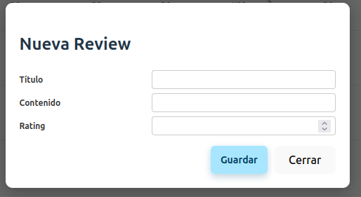
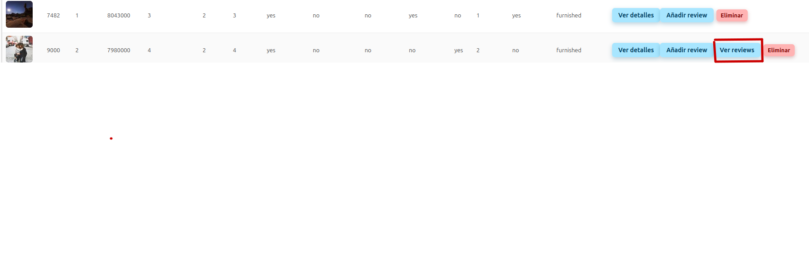
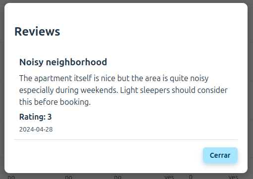

# Manual de Usuario  
## ApartmentPredictor — Gestión de Apartamentos y Reviews

Este manual explica cómo usar la interfaz web del proyecto **ApartmentPredictor**, desarrollada en React.  
---

# 1. Acceso a la aplicación

1. Inicia el servidor frontend:
   ```
   npm run dev
   ```
2. Abre el navegador en:
   ```
   http://localhost:5173
   ```

---

# 2. Pantalla principal

Al entrar verás:

- El título **Apartment Predictor**
- El botón **Nuevo Apartamento**
- La tabla con todos los apartamentos



---

# 3. Botón “Nuevo Apartamento”

El botón se debajo de la tabla.



---

# 4. Crear un nuevo apartamento

1. Pulsa **Nuevo Apartamento**.
2. Se abrirá un modal con un formulario vacío.
3. Rellena los campos.
4. Pulsa **Crear**.



---

# 5. Ver detalles de un apartamento

1. En la fila del apartamento, pulsa **Ver detalles**.
2. Se abrirá un modal con todos los datos del apartamento.



---

# 6. Editar un apartamento

1. Abre el modal con **Ver detalles**.
2. Modifica los campos necesarios.
3. Pulsa **Guardar cambios**.




---

# 7. Eliminar un apartamento

1. En la fila correspondiente, pulsa **Eliminar**.
2. El apartamento desaparecerá de la tabla.


---

# 8. Añadir una review

1. En la fila del apartamento, pulsa **Añadir review**.
2. Se abrirá un modal con un formulario.
3. Rellena:
   - Título
   - Contenido
   - Rating (1–5)
4. Pulsa **Guardar**.




---

# 9. Ver reviews de un apartamento

1. Si el apartamento tiene reviews, aparecerá el botón **Ver reviews**.
2. Al pulsarlo, se abrirá un modal con todas las reviews.



---

# 10. Resumen visual recomendado

| Sección | Pantallazo |
|--------|------------|
| Pantalla principal | Vista general |
| Nuevo Apartamento | Botón |
| Crear apartamento | Modal vacío |
| Ver detalles | Modal con datos |
| Editar apartamento | Modal editando |
| Tabla actualizada | Después de guardar |
| Añadir review | Modal formulario |
| Ver reviews | Modal reviews |

---


